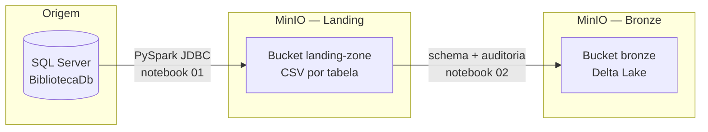

# Arquitetura Medalhão (Medallion Architecture)

A **Arquitetura Medalhão** é um padrão de design para Data Lakehouses que organiza os dados em camadas progressivas de qualidade.

## Visão geral



Fluxo resumido: **SQL Server** (origem relacional) → **CSV na Landing Zone** (MinIO, cópia fiel) → **Delta na Bronze** (MinIO, tipagem e metadados).

```
┌──────────────┐     ┌──────────────┐     ┌──────────────┐     ┌──────────────┐
│  SQL Server  │────▶│   Landing    │────▶│    Bronze    │────▶│   Silver /   │
│   (Origem)   │     │  (CSV cru)   │     │   (Delta)    │     │  Gold (Delta)│
└──────────────┘     └──────────────┘     └──────────────┘     └──────────────┘
   Notebook 00          Notebook 01          Notebook 02          (futuro)
```

## Camadas

### Landing Zone
- **Formato**: CSV
- **Bucket MinIO**: `landing-zone`
- **Objetivo**: Cópia fiel dos dados extraídos do SQL Server, sem transformação
- **Notebook**: `01_extracao_sqlserver_landing_zone.ipynb`
- **Infraestrutura**: o bucket é criado pelo `minio-init` no Docker e, em redundância, pelo próprio notebook via API S3 (**boto3**)

### Bronze
- **Formato**: Delta Lake (Parquet + Transaction Log)
- **Bucket MinIO**: `bronze`
- **Objetivo**: Dados com tipagem forte, schema enforcement e metadados de auditoria
- **Notebook**: `02_landing_to_bronze_delta.ipynb`
- **Infraestrutura**: o bucket é criado pelo `minio-init` no Docker e, em redundância, pelo notebook **`02`** (API S3 com **boto3**) antes da ingestão Delta
- **Colunas adicionais**: `_bronze_loaded_at`, `_bronze_source_file`

### Silver *(futuro)*
- Dados limpos, normalizados e com regras de negócio aplicadas

### Gold *(futuro)*
- Tabelas agregadas e modelos dimensionais prontos para consumo analítico
