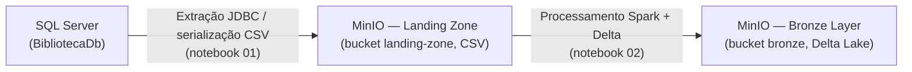

# Trabalho 2 — Engenharia de Dados

Este repositório documenta um pipeline de dados em ambiente académico: extração a partir do **Microsoft SQL Server**, armazenamento de ficheiros na **zona de aterragem** (*landing zone*) do **MinIO** (API compatível com S3) e materialização da camada **Bronze** em **Delta Lake**, processada com **Apache Spark** (PySpark).

## Fluxo de dados (origem à Bronze)

O diagrama seguinte sintetiza as transições lógicas entre sistemas e formatos, alinhadas aos notebooks numerados na pasta `notebook/`.



A etapa **00** prepara o esquema relacional e dados de referência no SQL Server; a etapa **01** exporta tabelas para CSV no MinIO; a etapa **02** aplica *schema enforcement*, metadados de auditoria e gravação transacional Delta na Bronze. O notebook **dml_bronze.ipynb** ilustra operações de manutenção e consulta ao histórico sobre uma tabela Delta já presente no *bucket* `bronze`.

## Stack principal

| Tecnologia   | Versão        | Função no trabalho                          |
|--------------|---------------|---------------------------------------------|
| SQL Server   | 2025 (Docker) | Sistema origem relacional                   |
| MinIO        | RELEASE.2025-02 | Armazenamento objeto estilo S3          |
| Apache Spark | 3.5.3 (PySpark) | Motor de processamento distribuído      |
| Delta Lake   | 3.2.0         | Formato de tabela com ACID e versionamento |
| Python       | 3.11 + UV     | Gestão de dependências e execução dos notebooks |

## Notebooks

| Ordem | Ficheiro | Descrição |
|-------|----------|-----------|
| 00 | `00_setup_sqlserver.ipynb` | Criação do `BibliotecaDb` e carga a partir dos CSV de referência |
| 01 | `01_extracao_sqlserver_landing_zone.ipynb` | Extração SQL Server → CSV no *bucket* `landing-zone` |
| 02 | `02_landing_to_bronze_delta.ipynb` | Leitura dos CSV, conformação de *schema* e gravação Delta no *bucket* `bronze` |
| 03 | `dml_bronze.ipynb` | Demonstração de DML (`INSERT`, `UPDATE`, `DELETE`) e auditoria `history()` na Bronze |

## Execução resumida

```bash
docker compose up -d
uv sync
uv run jupyter lab notebook/
```

Recomenda-se executar os notebooks **00 → 01 → 02** na primeira montagem do ambiente; o notebook **03** pressupõe tabelas Delta já existentes em `s3a://bronze/`.

Para consultar a documentação estática gerada pelo MkDocs, utilizar `uv run task docs_serve` na raiz do repositório.
