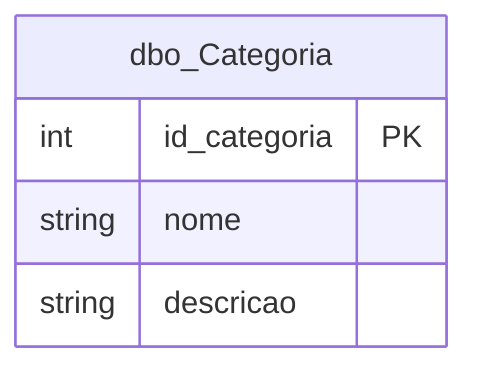
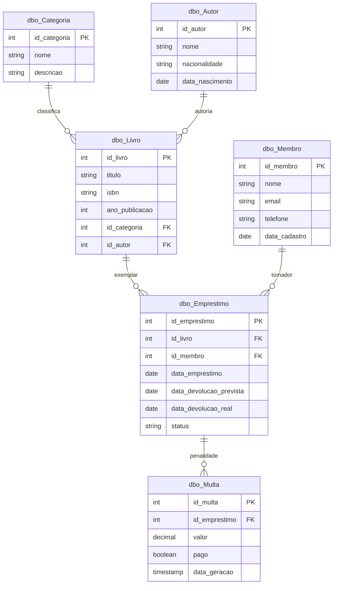

# Modelo entidade-relacionamento — BibliotecaDb

O esquema **BibliotecaDb** no Microsoft SQL Server constitui a fonte das relações extraídas nos notebooks `00` e `01`. As secções seguintes apresentam, primeiro, a entidade de referência **`dbo_Categoria`** (utilizada nos exemplos de DML na Bronze) e, em seguida, o modelo global com as restantes tabelas do domínio da biblioteca.

## Entidade de referência: `dbo_Categoria`

A tabela `dbo_Categoria` classifica os registos de livros na aplicação de exemplo. Na camada Bronze, após o notebook `02`, acrescentam-se colunas de auditoria (`_bronze_loaded_at`, `_bronze_source_file`), mantendo-se a chave primária `id_categoria`.

## Modelo global do domínio

O diagrama abaixo resume entidades, chaves e relacionamentos utilizados no pipeline até à Bronze.

As mesmas entidades aparecem como pastas Delta em `s3a://bronze/dbo_*` após o notebook `02_landing_to_bronze_delta.ipynb`, com colunas extras de auditoria na Bronze.
